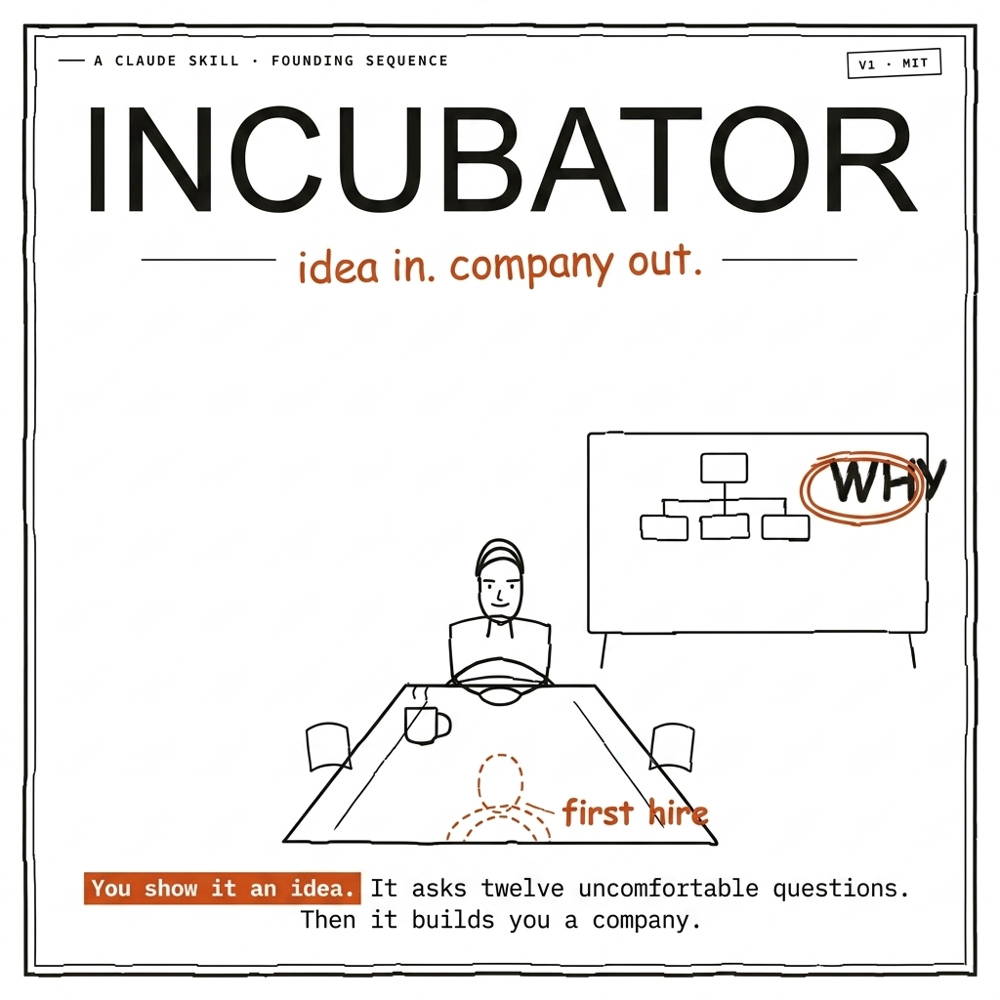

# Incubator — idea in, company out

[](https://github.com/afsalali1238/Incubator)

A Claude skill collection for **founding and running a new project from zero**. You bring an idea. You walk out with a validated thesis, a market-research report, a team of specialist AI agents — and a CEO that keeps orchestrating them for the entire lifecycle of the project.

Built for [Claude Cowork](https://claude.ai), Claude Code, and claude.ai.

---

## What it does

Invoke **`project-ceo`** at the start of any project. Claude becomes the **founding CEO** for your specific vertical — with real industry expertise, not generic advice. It runs a seven-phase sequence:

| Phase | Mode | What happens |
|-------|------|--------------|
| **1. Interview** | Interactive | CEO interrogates the idea one question at a time — exits only when you agree on a testable hypothesis. Captures your time budget and VC intent. |
| **2. Research** | Fully autonomous · hard cap 20 searches | Maps competitors by tier, reverse-engineers 2–4 winners' *build sequences*, digs the graveyard for causes of death, runs a mandatory devil's-advocate pass |
| **3. Report** | Autonomous | 9-panel Visual Document: Thesis → Market → Winners → Playbook → Graveyard → Heresy → Trends → Org → Call |
| **4. Hire the Team** | Interactive | Derives a 4–7 agent roster from your vertical, sequenced by what de-risks fastest. Quality-gates every generated skill — no flavor without substance. |
| **5. Board Meeting** | Ongoing | Per-agent 🟢/🟡/🔴 health scores, roster changes, riskiest current assumption, next action. Runs at every milestone or returning session. |
| **6. Data Room** | Conditional (VC track) | Converts research into a 10-slide pitch deck weighted on Graveyard and Playbook — why others failed, why this sequence wins. |
| **7. HQ Dashboard** | Automatic | Generates a zero-dependency dark-mode `hq.html` — your command centre. Charter, roster, calendar, hiring plan in one browser tab. |

**The CEO doesn't disappear after founding.** It writes an `INCUBATOR.md` index at your workspace root. Every time you return — "CEO check in", "let's work on the project" — it re-reads the roster, checks team health, and picks up exactly where the company left off.

---

## See it in action

The [`examples/airbnb/`](./examples/airbnb/) folder shows real output from a full run on the founding of Airbnb:

| File | What it shows |
|------|---------------|
| [`00_charter.md`](./examples/airbnb/00_charter.md) | One-pager: thesis, verdict, riskiest assumption, scope fence, org at a glance, next action |
| [`roster.md`](./examples/airbnb/roster.md) | Live team registry with 🟢/🟡/🔴 health scores and pending hire sequencing |
| [`hq.html`](./examples/airbnb/hq.html) | The rendered HQ Dashboard — open in a browser |
| [`team/community-supply-lead.md`](./examples/airbnb/team/community-supply-lead.md) | Agent persona brief with real domain depth (host acquisition, supply-demand theory, listing quality) |
| [`skills/community-supply-lead/SKILL.md`](./examples/airbnb/skills/community-supply-lead/SKILL.md) | Installable agent skill — real supply-side playbook, not generic marketplace advice |

---

## The company starter pack

```
<your-project>-company/
├── 00_charter.md            # thesis, CEO verdict, riskiest assumption, org at a glance
├── 01_findings-report.html  # the 9-panel research report
├── 02_hiring-plan.md        # org chart + sequenced hire order with reasons
├── 03_90-day-calendar.md    # week-by-week plan calibrated to your time budget
├── 04_pitch-deck.md         # 10-slide VC pitch deck (VC track only)
├── hq.html                  # dark-mode command centre — open in any browser
├── roster.md                # LIVE team registry with health scores — updated every session
├── team/                    # persona briefs, one per hired agent
└── skills/                  # installable specialist-agent skills, one per role

INCUBATOR.md                 # session index at workspace root — how the CEO finds your project
```

---

## Install

### Claude Code (one command)

```
/plugin marketplace add afsalali1238/Incubator
/plugin install incubator
```

Then: **"be the CEO for this — I'm building \<your idea\>"**

### Claude Cowork / claude.ai (manual)

1. Download [`dist/project-ceo.skill`](./dist/project-ceo.skill) — click the link, then click **Download raw file** (the down-arrow icon on GitHub)
2. Open [claude.ai](https://claude.ai) → click your avatar (bottom-left) → **Settings**
3. Go to **Skills** (left sidebar) → click **Add skill** → select the `.skill` file you downloaded
4. The skill installs instantly. Start a new conversation and say: **"I'm starting a new project, act as CEO"**

> **No claude.ai Skills tab?** You may be on a plan that doesn't support skills yet. Try Claude Code (see above) or paste the contents of `skills/project-ceo/SKILL.md` directly as a system prompt.

Or drop the `skills/project-ceo/` folder into your Claude Code skills directory if you prefer working from source.

---

## How to trigger it

**New project:**
- "I'm starting a new project — be the CEO for this."
- "I want to build \<X\>, help me kick it off."
- "Run point on this build as founder."

**Returning to a project:**
- "Let's work on the project."
- "CEO check in — where are we?"
- "Board meeting."
- Just name the project — the CEO finds `INCUBATOR.md` and picks up.

---

## How agents execute

**Two modes depending on your setup:**

- **Claude Code / Task tool available:** agents run as real subagents — the CEO spawns them, they work independently, and return results. Full multi-agent execution.
- **Claude Cowork / standard claude.ai:** agents activate as inline personas. The CEO labels them clearly (`[Activating: Growth Lead]` ... `[Back to CEO]`) and switches between them in the same conversation. Same domain expertise, no parallel execution.

The skill is useful in both modes. The difference is speed and parallelism, not quality of output.

---

## What's inside

```
Incubator/
├── .claude-plugin/
│   ├── plugin.json
│   └── marketplace.json
├── assets/
│   └── banner.png
├── skills/project-ceo/
│   ├── SKILL.md
│   └── references/
│       ├── interview.md            # decision tree + time-budget question
│       ├── research.md             # method + 20-search hard cap + graveyard protocol
│       ├── org-design.md           # vertical roster patterns + sequencing
│       ├── agent-skill-template.md # brief + skill templates + quality gate checklist
│       ├── starter-pack.md         # charter, calendar, roster, INCUBATOR.md format
│       ├── orchestration.md        # hire/fire/delegate/spawn + board meeting + health scores
│       └── hq-template.md          # the HQ Dashboard HTML template
├── examples/
│   ├── README.md                   # index of all examples
│   ├── airbnb/                     # ★ lead example — all 7 output files + hq.html
│   ├── slack-company/              # B2B messaging wedge
│   ├── uber-company/               # ride-hailing city launch
│   ├── gymshark-company/           # DTC fitness apparel
│   ├── oculus-company/             # consumer VR hardware
│   └── 23andme-company/            # consumer DNA testing
└── dist/
    └── project-ceo.skill           # packaged installable
```

---

## Companion skills (optional — works standalone without them)

- **`grill-me`** — relentless one-question-at-a-time interviewing
- **`karpathy-guidelines`** — surface assumptions, avoid overcomplication
- **`vd`** — Visual Document format used in Phase 3 (inline spec included as fallback)
- **`autoresearch`** — autonomous-loop discipline Phase 2 is modeled on

---

## Design

Built on the **AI-native startup lifecycle** — *Idea → MVP → Launch → Scale* — where the founder is the *orchestrator of agents*, not the individual contributor. The skill keeps your **sense-making ahead of your building**, because agentic coding makes building feel free and that's the trap.

Roster pattern adapted from [slavingia/skills](https://github.com/slavingia/skills).

---

## License

MIT © [Afsal Ali](https://github.com/afsalali1238)
